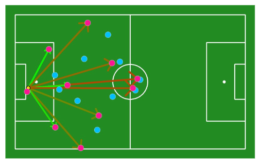
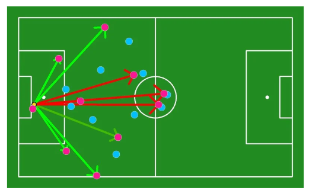
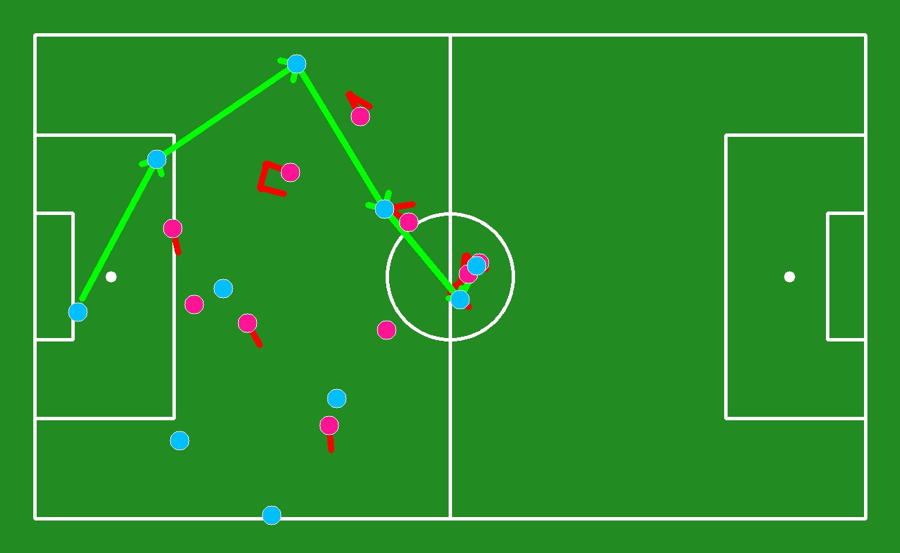

# Soccer Game Analyzer: Optimizing Goal Kick Strategies Using Computer Vision ⚽

This project aims to optimize goal kick strategies in soccer using **computer vision**. The system detects key events from broadcast video footage and provides tactical insights, helping coaches and analysts make informed decisions.

## Pass options


Here are two modes you can explore:

1. **Build Mode and Short Passes**:
   - Focuses on short passes by assessing player proximity and defensive pressure.

   <p align="center">
     
   </p>

2. **Long Passes Mode**:
   - Identifies long-pass opportunities, balancing pass viability with defensive threats.

   <p align="center">
     
   </p>

## Pass sequences generation

Here is an example of goal kick generated pass sequence (you can observe opponent reaction in red):

   <p align="center">
     
   </p>

## Prerequisites

Before running the system, ensure that you have the following:

1. **Python 3.6+** installed on your machine.
2. **Streamlit** and other required libraries.

## Installation


1. **Clone the repository**:
   
   First, clone the project repository by running:

   ```bash
   git clone https://github.com/aliamrrr/Passes_paper.git
   cd Passes_paper
   pip install -r requirements.txt

2. **Download the model**
   For privacy purposes, you can not have access to the player detection model (trained by RBFA). The model used in this project is a DETR model trained on a ZIP dataset containing players, ball, referee, side referee, and staff member annotations, you can use a pretrained model from Roboflow or train your own model.

   The path looks like this:
   Passes_paper/models/player_detect.pt

4. **Run the app with test video**:
   
   You're provided by a test video Belgium-Italy.mp4 (or you can use your own)

   Run this:

   ```bash
   streamlit run main.py

If you have any questions about the method, feedback, or advice, please feel free to reach out to me via email at ali-anass.amradouch@imt-atlantique.net.


